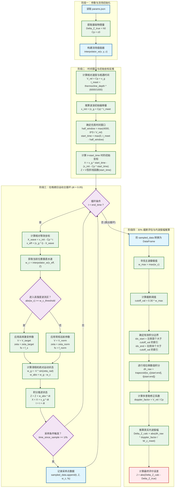

# Model 3 流程图

```mermaid
graph TD
    classDef init fill:#e1f5fe,stroke:#01579b,stroke-width:2px
    classDef calc fill:#e8f5e9,stroke:#2e7d32,stroke-width:2px
    classDef loop fill:#fff3e0,stroke:#ef6c00,stroke-width:2px
    classDef cond fill:#f3e5f5,stroke:#6a1b9a,stroke-width:2px
    classDef result fill:#ffebee,stroke:#c62828,stroke-width:2px

    %% 阶段一：初始化
    subgraph "阶段一：参数与流场初始化"
        A1[读取 params.json]:::init --> A2["提取基础物理量<br>Delta_Z_true = h0<br>Cp = c0"]:::calc
        A2 --> A3["构建流场插值器<br>interpolator_w(x, y, z)"]:::init
    end

    %% 阶段二：反推初始坐标
    subgraph "阶段二：时间窗口与初始坐标反推"
        A3 --> B1["计算相对速度与相遇时间<br>V_rel = Cp + v_g<br>t_meet = thermocline_depth * (6000/1000)"]:::calc
        B1 --> B2["推算波浪初始偏移量<br>x_init = (v_g + Cp) * t_meet"]:::calc
        B2 --> B3["确定仿真时间窗口<br>half_window = max(4000, 8*D / V_rel)<br>start_time = max(0, t_meet - half_window)"]:::calc
        B3 --> B4["计算 t=start_time 时的初始坐标<br>X = v_g * start_time - (x_init - Cp * start_time)<br>Z = V型折线函数(start_time)"]:::calc
    end

    %% 阶段三：主循环
    subgraph "阶段三：拉格朗日运动主循环 (dt = 0.05)"
        B4 --> C1{"循环条件<br>t < end_time ?"}:::cond
        
        C1 -- 是 --> C2["计算相对等效坐标<br>X_wave = x_init - Cp * t<br>x_eff = (v_g * t) - X_wave"]:::calc
        C2 --> C3["获取当前位置垂直水速<br>w_c = interpolator_w(x_eff, Z)"]:::calc
        
        C3 --> C4{"进入高强度波流区？<br>abs(w_c) >= w_c_threshold"}:::cond
        
        C4 -- 是 --> C5["应用高频激变参数<br>V = V_target<br>zeta = zeta_target<br>fs = f_s"]:::calc
        C4 -- 否 --> C6["应用常规巡航参数<br>V = V_norm<br>zeta = zeta_norm<br>fs = f_norm"]:::calc
        
        C5 --> C7["计算滑翔机绝对运动状态<br>w_g = -V * sin(zeta_rad)<br>w_abs = w_g - w_c"]:::calc
        C6 --> C7
        
        C7 --> C8["积分推进状态<br>Z = Z + w_abs * dt<br>X = X + v_g * dt<br>t = t + dt"]:::calc
        
        C8 --> C9{"采样条件触发？<br>time_since_sample >= 1/fs"}:::cond
        C9 -- 是 --> C10["记录采样点数据<br>sampled_data.append(t, Z, w_c, fs)"]:::init
        C9 -- 否 --> C1
        C10 --> C1
    end

    %% 阶段四：截断与评估
    subgraph "阶段四：30% 截断评估与内波振幅推算"
        C1 -- 否 (跳出循环) --> D1["将 sampled_data 转换为 DataFrame"]:::init
        D1 --> D2["寻找主波瓣极值<br>w_max = max(w_c)"]:::calc
        D2 --> D3["计算截断阈值<br>cutoff_val = 0.30 * w_max"]:::calc
        D3 --> D4["确定有效积分边界<br>idx_start = 左侧首个大于 cutoff_val 的索引<br>idx_end = 右侧末个大于 cutoff_val 的索引"]:::calc
        D4 --> D5["进行视位移数值积分<br>dh_raw = trapezoid(w_c[start:end], t[start:end])"]:::calc
        D5 --> D6["计算多普勒修正系数<br>doppler_factor = V_rel / Cp"]:::calc
        D6 --> D7["推算真实内波振幅<br>Delta_Z_calc = abs(dh_raw * doppler_factor / W_z_meet)"]:::calc
        D7 --> D8["计算最终评价误差<br>J = abs(Delta_Z_calc - Delta_Z_true)"]:::result
    end
```