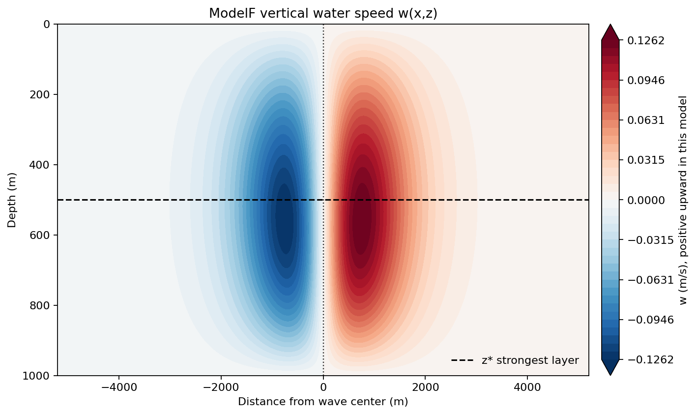
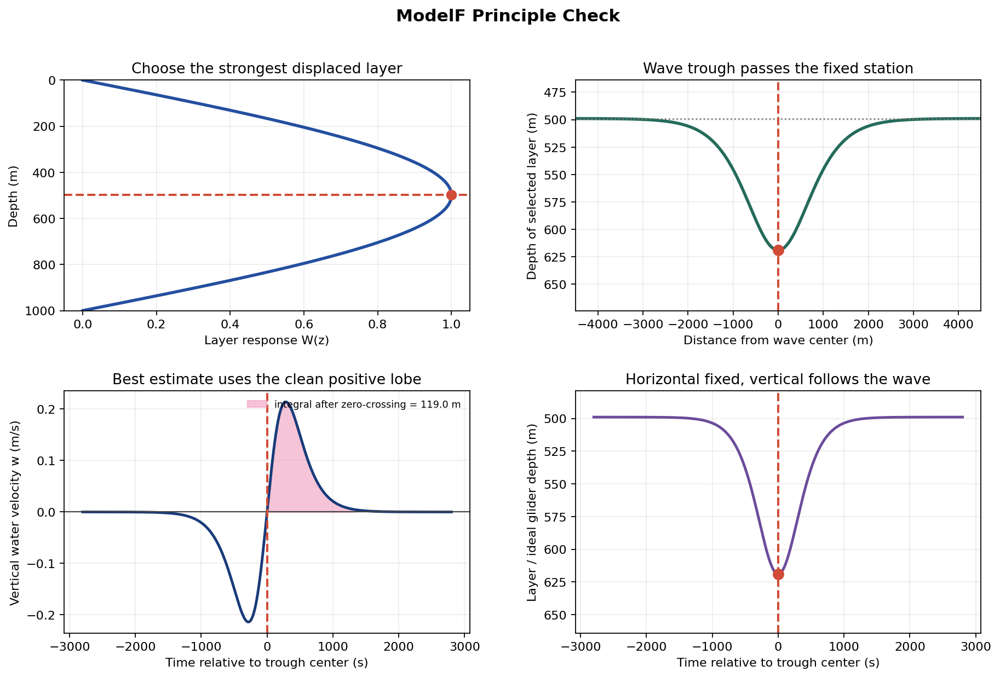
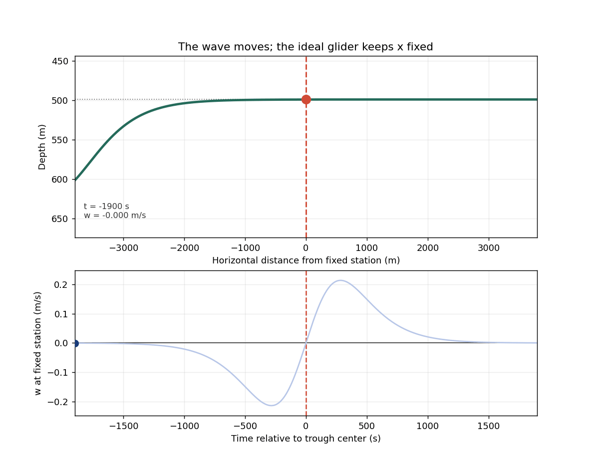
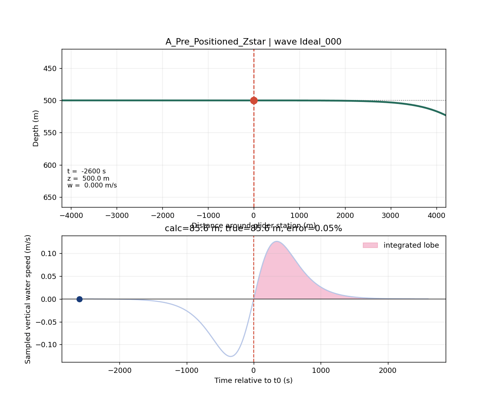
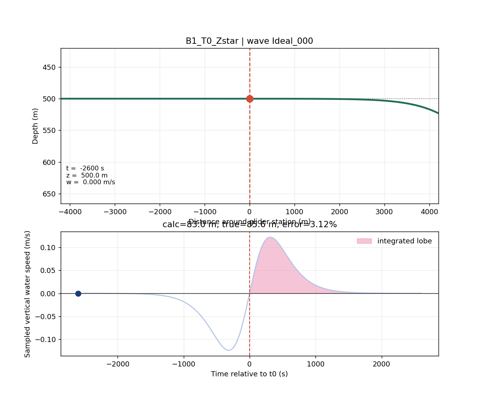
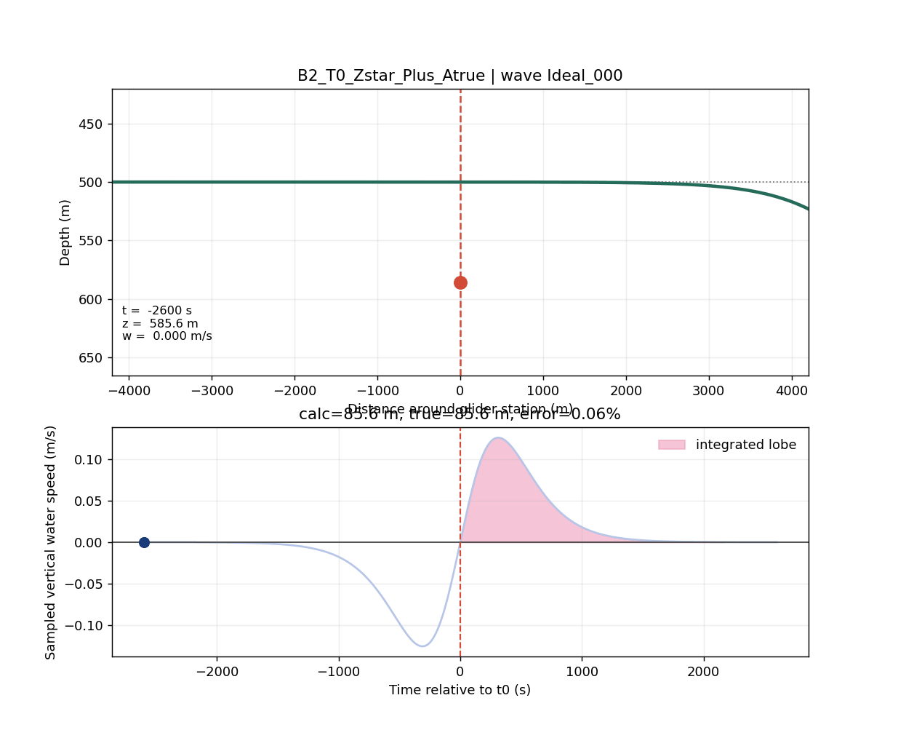
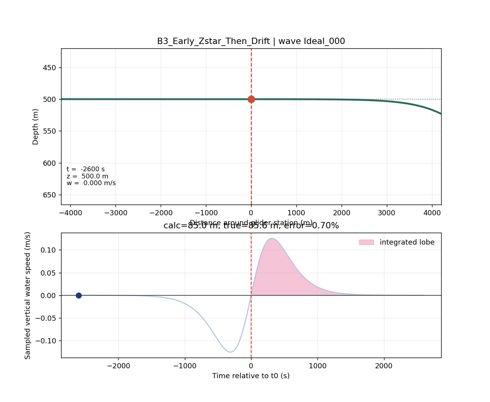
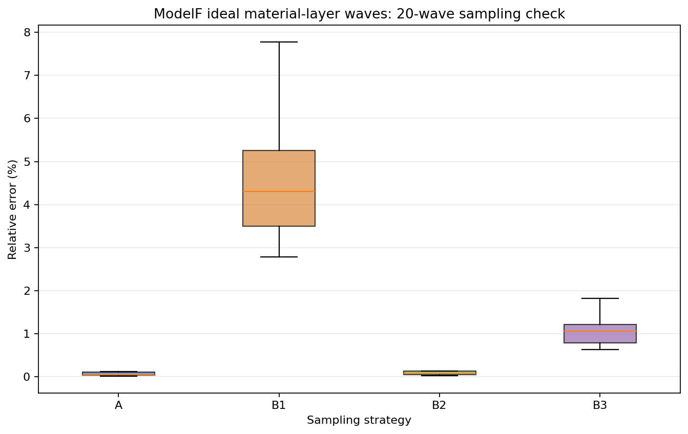

# ModelF 原理验证：汇报与继续研究说明

## 1. 研究目标

ModelF 用于验证水下滑翔机基于垂直水速积分反演内孤立波振幅时的最优采样方式。

核心问题是：

> 当水下滑翔机利用 `w_water = w_observed - w_still_water` 得到内孤立波垂直水速，并通过时间积分估计垂向位移时，滑翔机应该如何进入内孤立波结构，才能使振幅估计最准确？

本阶段重点验证如下假设：

> 若滑翔机在内孤立波主波瓣到达前进入垂向响应最强的背景水层 `z*`，并尽量保持水平位置不变，使其随后随内孤立波诱导的垂直水速上下运动，则垂直水速积分对振幅的估计误差应显著降低。

## 2. 关键物理量

### 2.1 垂直水速 `w`

本文中的 `w` 表示海水垂直速度，而不是水层位移。

- `w < 0`：水体向下运动。
- `w = 0`：波谷中心附近，水层位移最大，但瞬时垂直速度接近零。
- `w > 0`：水体向上运动。

因此，振幅估计不能只依赖波谷中心单点，而应依赖波谷前后垂直速度主波瓣的积分：

```text
dh = integral(w dt)
```

### 2.2 目标水层 `z*`

`z*` 表示背景垂向结构中位移响应最强的水层。该层通常具有较强垂直速度信号，因此信噪比较高，适合作为振幅反演的关键采样层。

## 3. ModelA 与 ModelF 的关系

原 ModelA 已经能够生成内孤立波导致的温度/等温面位移结构，但其垂直速度场更接近按当前几何深度赋值。对于固定深度观测，该近似可以使用；但对于“滑翔机跟随同一原始水层上下运动”的拉格朗日式采样验证，该速度场与水层标签之间存在不完全一致。

更具体地说，内波垂直速度可理解为：

```text
w(x,z,t) = F(x - ct) * W(z)
```

其中 `F(x - ct)` 表示内孤立波经过时共同的时间/水平波形，`W(z)` 表示不同背景水层的垂向响应强弱。问题的关键在于，这里的 `z` 对于拉格朗日采样应表示“原始水层标签 `z0`”，而不是“当前几何深度 `z_current`”。

例如，若原始 150 m 水层处于强响应区，内波经过时它可能被压到 250 m。此时：

```text
150 m = 这团水的原始水层标签
250 m = 这团水当前所在的几何深度
```

这团水到达 250 m 后，仍然是原来 150 m 的水团。它的垂直速度强弱应继续使用 `W(150m)`，而不是突然改用 `W(250m)`。否则就等于在运动过程中把同一团水换成了另一个背景水层，速度积分得到的位移将不再对应同一个水团。

因此，ModelF 构造了一套理想化但内部自洽的内孤立波场：

1. 水层位移由原始背景水层决定。
2. 当前实际深度处的垂直速度来自被位移到该位置的原始水层。
3. 位移场和速度场使用同一套水层标签。

这样可以隔离验证采样原理本身，而不受 ModelA 原速度场坐标解释差异影响。

## 4. 垂直水速场可视化

下图为 ModelF 生成的理想内孤立波垂直水速场 `w(x,z)`。红蓝两侧代表相反方向的垂直运动。波谷中心附近位移最大，但垂直速度接近零；波谷前后存在主要的负、正垂直速度波瓣。



## 5. 原理示意

理想采样过程中，内孤立波相对滑翔机水平通过。滑翔机提前进入 `z*` 附近并尽量维持水平位置，使其能够经历完整的下压与上抬过程。振幅估计主要来自过零点后主垂直速度波瓣的积分。





## 6. 四种采样策略

### A：提前驻守型

滑翔机在内孤立波到达前已位于 `z*` 附近，水平位置尽量不变。内孤立波通过时，滑翔机随水体垂向运动。

这是理论上最理想的采样方式。



### B1：`t0` 到达静水背景 `z*`

滑翔机在波谷中心时刻 `t0` 才到达静水背景下的 `z*`。

该策略接近原先 ModelB 中的设定，但未完整经历波谷前的下压过程，因此存在较大系统误差。



### B2：`t0` 到达 `z* + Atrue`

滑翔机在 `t0` 到达真实最大下压后的深度。

该策略误差很低，但需要提前知道真实振幅 `Atrue`，因此只能作为理论对照，不能作为实际工程策略。



### B3：提前到达 `z*` 后随波运动

滑翔机在 `t0` 前提前进入 `z*` 附近，随后受内孤立波垂直速度影响自然下沉和抬升。

该策略兼顾物理合理性和工程可实现性，是后续优化最值得重点研究的方向。



## 7. 20 组理想波验证结果

ModelF 生成 20 组内部自洽的理想内孤立波数据，并分别测试 A/B1/B2/B3 四种策略。

| 策略 | 物理含义 | 平均相对误差 | 中位数 |
|---|---|---:|---:|
| A | 提前在 `z*`，水平近似固定，随波上下 | 0.098% | 0.058% |
| B1 | `t0` 到达静水背景 `z*` | 4.669% | 4.302% |
| B2 | `t0` 到达 `z* + Atrue` | 0.115% | 0.073% |
| B3 | 提前到达 `z*`，再被波带动 | 1.112% | 1.068% |



## 8. 结果解读

1. A 策略误差接近零，说明“提前进入强响应层并随波上下”的原理在自洽波场中成立。
2. B1 误差明显更高，说明仅在 `t0` 到达静水背景 `z*` 不能代表真实波谷下沉后的水层运动。
3. B2 误差接近零，但工程上不可直接使用，因为它依赖未知真实振幅。
4. B3 误差约为 1%，明显优于 B1，具有进一步工程优化价值。

## 9. 程序说明

- `ModelF_Ideal_Wave_Generate.py`  
  生成内部自洽的理想内孤立波数据。

- `ModelF_Sampling_Strategies.py`  
  实现 A/B1/B2/B3 四类采样策略和统一振幅反演公式。

- `ModelF_Ideal_Wave_Experiment.py`  
  执行 20 组理想波采样实验并输出误差统计。

- `ModelF_Sampling_Animation_Plot.py`  
  生成滑翔机轨迹、垂直水速曲线和积分区域动图。

- `ModelF_Principle_Visualization.py`  
  生成采样原理示意图和动图。

- `ModelF_Vertical_Velocity_Visualization.py`  
  可视化内孤立波垂直水速场 `w(x,z)`。

## 10. 后续研究建议

建议将 B3 作为后续工程优化主线：

1. 研究提前进入 `z*` 的最佳时间窗口。
2. 加入滑翔机真实动力学约束，包括滑翔角、水平速度、垂向速度和能耗限制。
3. 加入内孤立波到达时间误差，分析预报误差对振幅反演的影响。
4. 将 ModelF 的自洽波场思想推广到三维弯曲波前场。
5. 在贝叶斯优化框架中，以 B3 为基础搜索最优采样控制参数。

## 11. 当前结论

从原理验证角度看，最优采样方式不是简单地在 `t0` 到达静水背景 `z*`，而是应在内孤立波主波瓣到达前进入强响应水层，使滑翔机经历完整的垂直速度变化过程。

理论最优为 A；工程上更可行且值得继续优化的是 B3。
