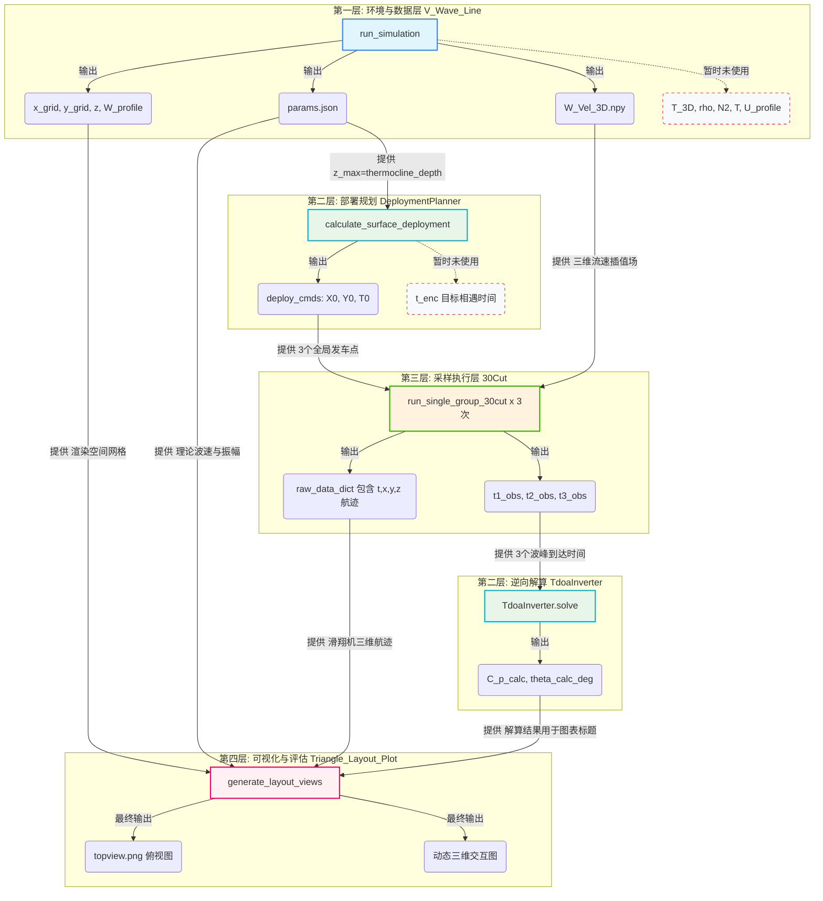

```mermaid
graph TD
    %% 定义样式
    classDef layer1 fill:#e1f5fe,stroke:#3a86ff,stroke-width:2px;
    classDef layer2 fill:#e8f5e9,stroke:#00b4d8,stroke-width:2px;
    classDef layer3 fill:#fff3e0,stroke:#38b000,stroke-width:2px;
    classDef layer4 fill:#fff0f3,stroke:#ff006e,stroke-width:2px;
    classDef unused fill:#f8f9fa,stroke:#ef233c,stroke-dasharray: 5 5;

    subgraph 第一层: 环境与数据层 V_Wave_Line
        A[run_simulation] -->|输出| D1(W_Vel_3D.npy)
        A -->|输出| D2(params.json)
        A -->|输出| D3(x_grid, y_grid, z, W_profile)
        A -.->|暂时未使用| U1(T_3D, rho, N2, T, U_profile)
    end
    class A layer1

    subgraph 第二层: 部署规划 DeploymentPlanner
        D2 -->|提供 z_max=thermocline_depth| B1[calculate_surface_deployment]
        B1 -->|输出| D4(deploy_cmds: X0, Y0, T0)
        B1 -.->|暂时未使用| U2(t_enc 目标相遇时间)
    end
    class B1 layer2

    subgraph 第三层: 采样执行层 30Cut
        D4 -->|提供 3个全局发车点| C1[run_single_group_30cut x 3次]
        D1 -->|提供 三维流速插值场| C1
        C1 -->|输出| D5(t1_obs, t2_obs, t3_obs)
        C1 -->|输出| D6(raw_data_dict 包含 t,x,y,z 航迹)
    end
    class C1 layer3

    subgraph 第二层: 逆向解算 TdoaInverter
        D5 -->|提供 3个波峰到达时间| B2[TdoaInverter.solve]
        B2 -->|输出| D7(C_p_calc, theta_calc_deg)
    end
    class B2 layer2

    subgraph 第四层: 可视化与评估 Triangle_Layout_Plot
        D3 -->|提供 渲染空间网格| E1[generate_layout_views]
        D2 -->|提供 理论波速与振幅| E1
        D6 -->|提供 滑翔机三维航迹| E1
        D7 -->|提供 解算结果用于图表标题| E1
        E1 -->|最终输出| O1(topview.png 俯视图)
        E1 -->|最终输出| O2(动态三维交互图)
    end
    class E1 layer4
    class U1,U2 unused
```