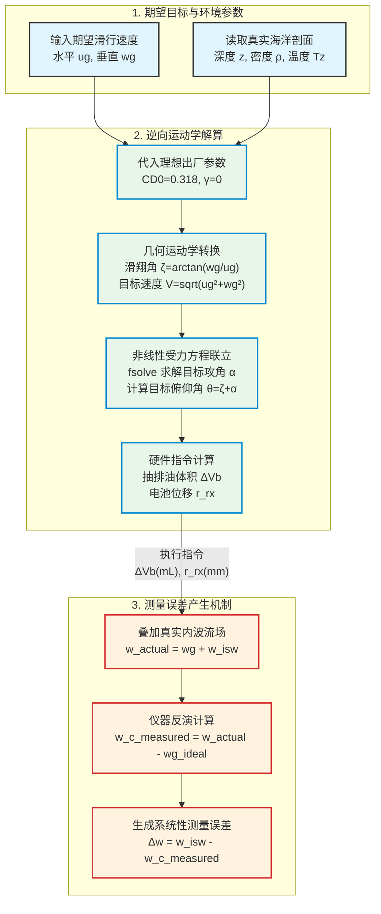

```mermaid
graph TD
    %% 样式定义
    classDef input fill:#e1f5fe,stroke:#333,stroke-width:2px
    classDef brain fill:#e8f5e9,stroke:#0288d1,stroke-width:2px
    classDef ocean fill:#ffebee,stroke:#388e3c,stroke-width:2px
    classDef output fill:#fff3e0,stroke:#d32f2f,stroke-width:2px

    subgraph sg1["1. 期望目标与环境参数"]
        A["输入期望滑行速度<br/>水平 ug, 垂直 wg"]:::input
        B["读取真实海洋剖面<br/>深度 z, 密度 ρ, 温度 Tz"]:::input
    end

    A --> C
    B --> C

    subgraph sg2["2. 逆向运动学解算"]
        C["代入理想出厂参数<br/>CD0=0.318, γ=0"]:::brain
        C --> D["几何运动学转换<br/>滑翔角 ζ=arctan(wg/ug)<br/>目标速度 V=sqrt(ug²+wg²)"]:::brain
        D --> E["非线性受力方程联立<br/>fsolve 求解目标攻角 α<br/>计算目标俯仰角 θ=ζ+α"]:::brain
        E --> F["硬件指令计算<br/>抽排油体积 ΔVb<br/>电池位移 r_rx"]:::brain
    end

    F -->|"执行指令<br/>ΔVb(mL), r_rx(mm)"| L

    subgraph sg4["3. 测量误差产生机制"]
        L["叠加真实内波流场<br/>w_actual = wg + w_isw"]:::output
        L --> M["仪器反演计算<br/>w_c_measured = w_actual - wg_ideal"]:::output
        M --> N["生成系统性测量误差<br/>Δw = w_isw - w_c_measured"]:::output
    end
```